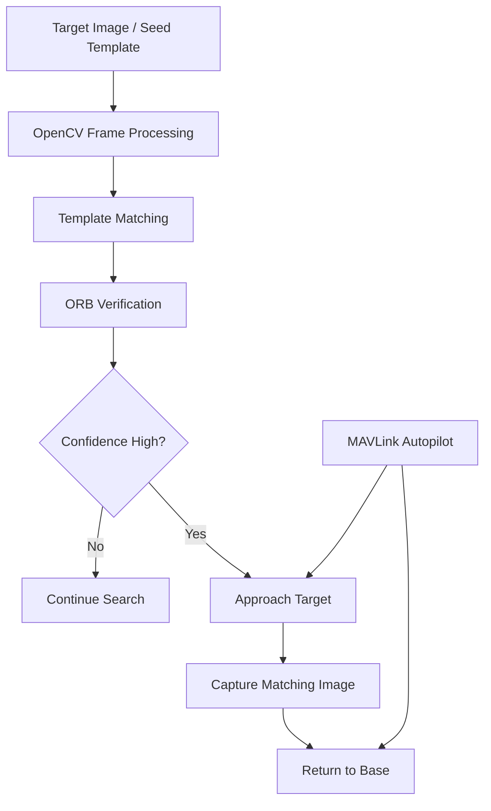
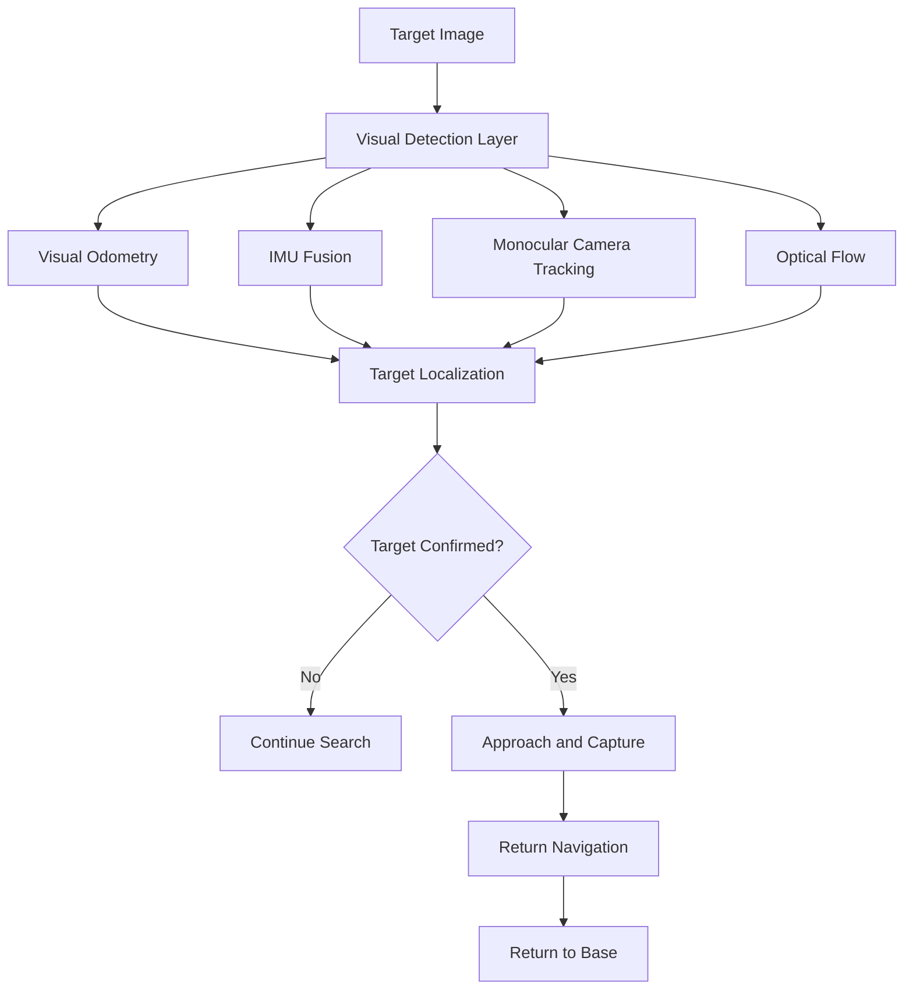

# ICARUS An Autonmous UAV System

## About

**IRACUS template matching-and-navigation-for-UAV-** (*Integrated Robotic Autonomous Cognitive Unit for Search & Approach*) is a lightweight autonomous drone system built with **Python, OpenCV, and MAVLink**. It is designed to take a target image as input, search for the matching object or template during flight, approach it autonomously, capture the target, and then return to base.

The project is being developed in layers, starting from a basic visual search pipeline and moving toward a more advanced perception-and-navigation stack. It combines computer vision, onboard estimation, and flight control for real-world autonomous target acquisition.

## Core Idea

The drone receives a **seed/target image** and then:
1. Searches the environment visually.
2. Detects a matching object or template in real time.
3. Moves closer to improve confirmation.
4. Captures the matching target.
5. Returns safely to base.

## System Layers

## Feature Matching Example — Python Base Layer

<p align="center">
  
  
</p>

### Basic Layer
The basic version focuses on robust visual search using:
- Template matching.
- ORB feature verification.
- Parallel frame processing.
- Confidence-based zoom and confirmation.
- MAVLink integration for autonomous control.

### Advanced Layer
The advanced version extends the system with:
- Visual odometry.
- IMU fusion.
- Monocular camera-based navigation.
- Optical flow.
- More reliable target localization.
- Smarter decision-making for approach and return.

## Basic Pipeline


## Advanced CV pipline
flowchart TD
    A[Target Image] --> B[Basic Search Layer: Template Matching + ORB]
    A --> C[Advanced Search Layer: SuperPoint + LightGlue]
    B --> D[Candidate Target Region]
    C --> E[Robust Keypoint Matches]
    D --> F[MAVLink Guidance]
    E --> F
    F --> G[Approach Target]
    G --> H[Capture Image]
    H --> I[Return to Base]

## Full Pipeline



## Basic Search Logic

The basic system currently uses:
- Template matching to find likely target regions.
- ORB feature matching to verify the match.
- A confidence threshold to decide when the drone should move closer.
- Parallel processing to improve speed on limited hardware.

## Advanced Vision Stack

The advanced system is designed to support:
- Better robustness in cluttered terrain.
- Higher confidence target identification.
- Tracking over multiple frames.
- Navigation-aware perception.
- Sensor fusion for stable autonomous flight.

## Technologies Used

- Python
- OpenCV
- MAVLink
- ROS bag processing
- ORB feature matching
- Template matching
- LightGlue / SuperPoint
- IMU integration
- Optical flow
- Visual odometry

## Project Status

This project is currently **under development** and evolving from a template-matching drone search system into a more complete autonomous perception and navigation framework.

## Goal

The goal of ICARUS is to create a drone that can:
- Search autonomously for a target image.
- Detect the object visually in real flight conditions.
- Approach it safely.
- Capture the target.
- Return home with minimal human intervention.

## Repository Structure

```text
ICARUS/
├── basic_search/
│   └── template_orb_search.py
├── advanced_vision/
│   └── lightglue_tracker.py
├── docs/
├── assets/
├── README.md
└── requirements.txt
```

## Future Work

- Add full MAVLink mission planning.
- Integrate waypoint-based search patterns.
- Improve visual odometry and optical flow fusion.
- Support onboard target re-identification.
- Add automatic return-to-home logic after detection.
- Test on real flight hardware.

## Note

This project is focused on autonomous search-and-approach behavior for aerial robotics and computer vision research.
